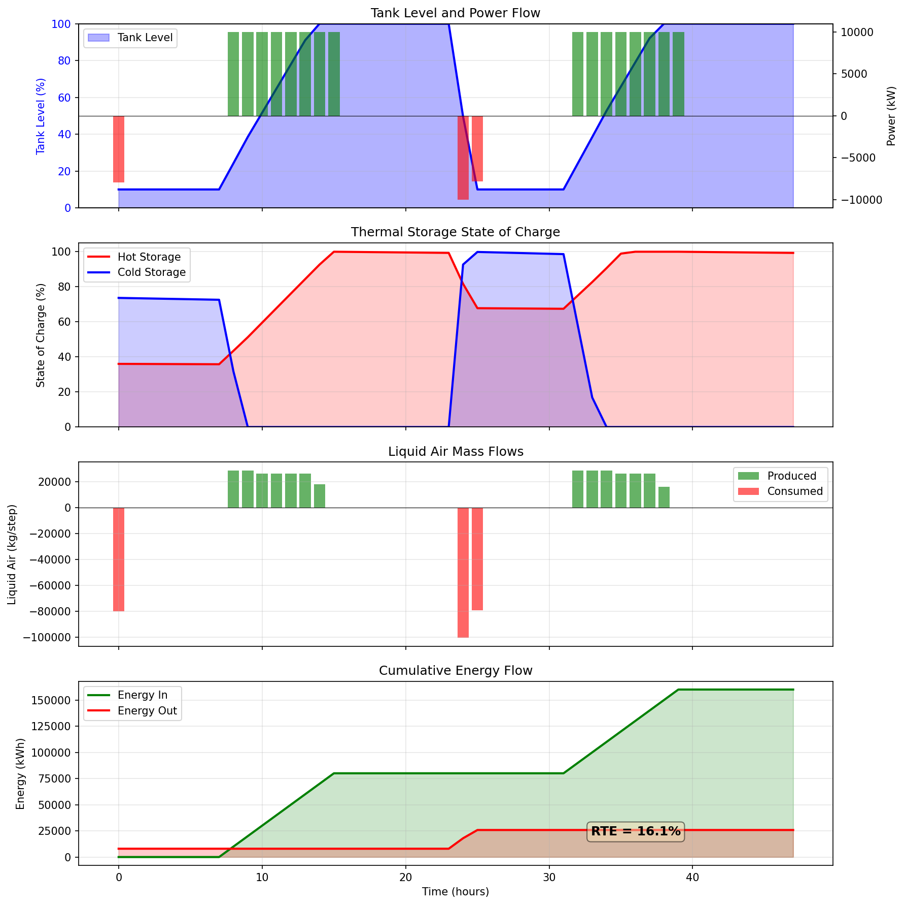

# LAES - Liquid Air Energy Storage Model

[](https://www.python.org/downloads/)
[](https://github.com/psf/black)

A first-principles thermodynamic and economic model for Liquid Air Energy Storage (LAES) systems.



## 🔋 What is LAES?

Liquid Air Energy Storage stores electrical energy by:
1. **Charging**: Liquefying air during off-peak hours (cheap electricity)
2. **Storing**: Keeping liquid air in insulated tanks at -196°C
3. **Discharging**: Expanding the liquid air through turbines during peak demand

### Key Advantages
- ⏱️ **Long duration storage** (4-12+ hours)
- 🌍 **No geographical constraints** (unlike pumped hydro)
- 🔄 **No degradation** (unlike batteries)
- 🏭 **Proven industrial components**

## ✨ Features

| Feature | Description |
|---------|-------------|
| ⚡ **Thermodynamics** | Claude cycle liquefaction, direct expansion power recovery |
| 🔄 **Cold Recycle** | Thermal storage integration for improved efficiency |
| 📊 **Transient Simulation** | Time-domain operation with configurable schedules |
| 💰 **Economics** | CAPEX, OPEX, NPV, IRR, LCOS analysis |
| 📈 **Visualization** | Auto-generated plots for analysis |

## 🚀 Quick Start

### Installation

```bash
# Clone the repository
git clone https://github.com/YOUR_USERNAME/laes-model.git
cd laes-model

# Install dependencies
pip install -r requirements.txt

# Install package in development mode
pip install -e .
```

### Basic Usage

```bash
# Run with default settings (10 MW / 4-hour plant)
python -m laes

# Custom plant configuration
python -m laes --power 50 --hours 6 --tank 1000

# Different electricity prices
python -m laes --offpeak 20 --onpeak 150

# 48-hour simulation showing cold recycle
python -m laes --schedule two_day
```

### Python API

```python
from laes import PlantConfig, LAESSimulator, calculate_rte, calculate_economics

# Create configuration
config = PlantConfig(
    charge_power_MW=50,
    discharge_power_MW=50,
    storage_duration_hours=6,
    tank_capacity_tonnes=1000,
)

# Calculate thermodynamic performance
rte_result = calculate_rte(config, verbose=True)
print(f"Round-trip efficiency: {rte_result['rte_with_cold']:.1%}")

# Run transient simulation
sim = LAESSimulator(config)
schedule = [
    ('discharge', 4),  # Morning peak
    ('idle', 4),
    ('charge', 8),     # Night charging
    ('idle', 8),
]
results = sim.run(schedule, verbose=True)
sim.plot_results('my_simulation.png')

# Economic analysis
econ = calculate_economics(config, rte=rte_result['rte_with_cold'], verbose=True)
print(f"NPV: ${econ['npv']/1e6:.1f} million")
print(f"LCOS: ${econ['lcos_per_MWh']:.0f}/MWh")
```

## 📖 Command Line Options

| Option | Default | Description |
|--------|---------|-------------|
| `--power` | 10 | Plant power rating [MW] |
| `--hours` | 4 | Storage duration [hours] |
| `--tank` | 200 | Tank capacity [tonnes] |
| `--offpeak` | 30 | Off-peak electricity price [$/MWh] |
| `--onpeak` | 80 | On-peak electricity price [$/MWh] |
| `--schedule` | two_day | Operating schedule |
| `--output` | laes_simulation.png | Output plot filename |
| `--no-plot` | - | Skip generating plots |
| `--quiet` | - | Minimal output |

### Available Schedules

- `default` - 24-hour cycle (charge → discharge)
- `two_day` - 48-hour cycle showing cold recycle
- `peak_shaving` - Multiple short discharge periods

## 📁 Project Structure

```
laes-model/
├── README.md               # This file
├── requirements.txt        # Dependencies
├── setup.py                # Package installation
├── .gitignore              # Git ignore patterns
│
├── laes/                   # Main package
│   ├── __init__.py         # Public API
│   ├── __main__.py         # CLI entry point
│   ├── cli.py              # Command-line interface
│   ├── config.py           # Configuration dataclass
│   ├── thermodynamics.py   # Cycle calculations
│   ├── storage.py          # Tank & thermal storage
│   ├── simulation.py       # Transient simulator
│   └── economics.py        # Financial analysis
│
├── examples/               # Example scripts
│   └── example_usage.py
│
├── tests/                  # Unit tests
│   ├── __init__.py
│   └── test_laes.py
│
└── docs/                   # Documentation (optional)
    └── laes_simulation.png
```

## 🔬 Model Details

### Liquefaction Cycle (Claude Cycle)

```
Air Inlet → [Compressor] → [Intercooler] → [Heat Exchanger] → [Cold HX]
                                                                  ↓
                                              ┌─────────────────────┤
                                              ↓                     ↓
                                         [Turbine]             [J-T Valve]
                                              ↓                     ↓
                                         Cold Gas              Liquid Air
                                              ↓                     ↓
                                          Recycle               Storage
```

### Power Recovery Cycle

```
Liquid Air → [Cryo Pump] → [Cold Recovery] → [Evaporator] → [Superheater]
    ↑                           ↓                               ↓
  Tank                    Cold Storage                     [Turbine]
                                                               ↓
                                                          Electricity
```

### Key Performance Metrics

| Metric | Without Cold Recycle | With Cold Recycle |
|--------|:-------------------:|:-----------------:|
| Liquid Yield | ~30% | ~38% |
| Specific Consumption | 0.40 kWh/kg | 0.35 kWh/kg |
| Round-Trip Efficiency | 25-26% | 28-30% |

## 📊 Example Output

```
══════════════════════════════════════════════════════════════
 ROUND-TRIP EFFICIENCY
══════════════════════════════════════════════════════════════
 Without cold recycle: 26.1%
 With cold recycle:    28.4%
 Improvement:          +8.7%

══════════════════════════════════════════════════════════════
 SIMULATION RESULTS (48 hours)
══════════════════════════════════════════════════════════════
 Energy in:  160,000 kWh
 Energy out:  41,807 kWh
 Round-trip efficiency: 26.1%

══════════════════════════════════════════════════════════════
 FINANCIAL METRICS
══════════════════════════════════════════════════════════════
 CAPEX:   $24.1 million ($603/kWh)
 NPV:     $-25.1 million
 LCOS:    $769/MWh
```

## 🧪 Running Tests

```bash
# Install pytest
pip install pytest

# Run all tests
pytest tests/ -v

# Run specific test class
pytest tests/test_laes.py::TestThermodynamics -v

# Run with coverage
pip install pytest-cov
pytest tests/ --cov=laes --cov-report=html
```

## 📚 References

1. Morgan, R., et al. (2015). "Liquid air energy storage – Analysis and first results from a pilot scale demonstration plant." *Applied Energy*, 137, 845-853.

2. Highview Power. [Commercial LAES Systems](https://highviewpower.com/)

3. Sciacovelli, A., et al. (2017). "Liquid air energy storage – Operation and performance of the first pilot plant in the world." *ECOS 2017*.

4. Ameel, B., et al. (2013). "Thermodynamic analysis of energy storage with a liquid air Rankine cycle." *Applied Thermal Engineering*, 52(1), 130-140.

## 🤝 Contributing

Contributions are welcome! Here's how:

1. **Fork** the repository
2. **Create** a feature branch: `git checkout -b feature/amazing-feature`
3. **Commit** your changes: `git commit -m 'Add amazing feature'`
4. **Push** to the branch: `git push origin feature/amazing-feature`
5. **Open** a Pull Request

### Ideas for Contributions

- [ ] Add more liquefaction cycles (Linde, Kapitza)
- [ ] Implement part-load efficiency curves
- [ ] Add optimization module for dispatch
- [ ] Create interactive Jupyter notebooks
- [ ] Add more detailed cost correlations
- [ ] Implement waste heat integration scenarios


## 👤 Author

**Inigo Antony**
- GitHub: [@Inigo-Antony](https://github.com/Inigo-Antony)
- Email: inigoantony16@gmail.com

## 🙏 Acknowledgments

- [CoolProp](http://www.coolprop.org/) for thermodynamic property calculations
- [Highview Power](https://highviewpower.com/) for pioneering commercial LAES
- The open-source community for Python scientific computing tools

---

<p align="center">
  Made with ❄️ for the energy storage community
</p>
